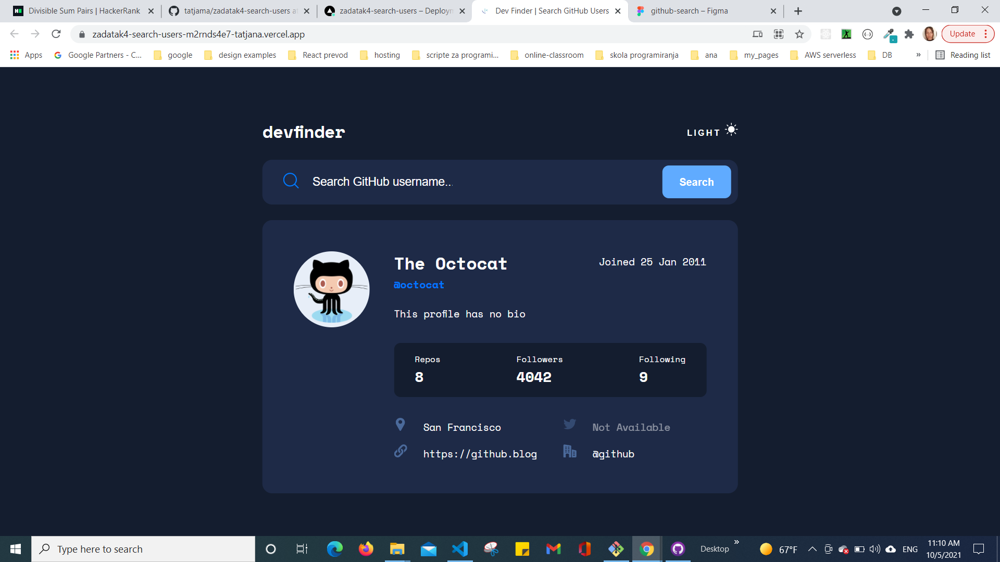

# Tatjana Marković Frontend Mentor - Dev Finder | GitHub User Search App

## Table of contents

  - [Overview](#overview)
  - [The challenge](#the-challenge)
  - [Screenshot](#screenshot)
  - [Links](#links)
  - [My process](#my-process)
  - [Built with](#built-with)
  - [Author](#author)
## Overview

- On first load
  1. Check prefers color scheme, and apply desired color scheme.
  2. Show the profile information for Octocat.
  3. Autofocus on search input

- Hover behavior: cursor-pointer
  1. Color Theme icon and title are change from gray to black on light mode.
  2. Color Theme icon and title are change from white to gray on dark mode.
  3. Search button background color lighter
  4. Links Twitter, Web and Company decorated underline

- Search behavior  
  1. if input is blank and new search is made - not fetching and show error message
  2. if no validate - not fetch and show error message
  3. if no user -  show error message
  4. if user - render profile page 
      - If a GitHub user hasn't added their name, show their username where the name would be    without the `@` symbol
      - If a GitHub user's bio is empty, show the text "This profile has no bio" with transparency added.
      - If any of the location, website, twitter, or company properties are empty, show the text "Not Available" with transparency added.
      - Website, twitter, and company information are links to those resources.      

- Display an error messages:
  1. "No results" - if no user is found when a new search is made.
  2. "Only letters and numbers!" if input values are not letters or numbers.
  3. "Search cannot be empty" if input is blank and new search is made.

### The challenge

Your challenge is to build out this GitHub user search app using the [GitHub users API](https://docs.github.com/en/rest/reference/users#get-a-user) and get it looking as close to the design as possible.

Your users should be able to:

- View the optimal layout for the app depending on their device's screen size
- See hover states for all interactive elements on the page
- Search for GitHub users by their username
- See relevant user information based on their search
- Switch between light and dark themes
- **Bonus**: Have the correct color scheme chosen for them based on their computer preferences. _Hint_: Research `prefers-color-scheme` in CSS.

The GitHub users API endpoint is `https://api.github.com/users/:username`. So, if you wanted to search for the Octocat profile, you'd be able to make a request to `https://api.github.com/users/octocat`.

### Screenshot

### Links

- Solution URL: [GitHub](https://github.com/tatjama/zadatak4-search-users/tree/develop)
- Preview: [Vercel](https://zadatak4-search-users-m2rnds4e7-tatjana.vercel.app/)
- Live Site URL: [Vercel](https://zadatak4-search-users.vercel.app/)

## My process

1. Create a new project
2. Import starting code
3. Initializing git repositories main and develop
4. Import git repositories to the Vercel project
5. Create HTML structure
6. Use Figma design tools for style
7. Create CSS Utility
8. Style for Desktop
9. Create Dark Theme Style
10. Responsive Tablet style
11. Responsive Mobile style
12. Form validation
13. Fetch API
14. Error handler
15. Theme toggling
16. Correct color by Prefers colors scheme
17. Compare original designs with my work
18. Create screenshots
19. Change README-template.md to README.md
20. Open Pull request
21. Solve Issue
22. Merge develop branch into master branch
### Built with

1. Semantic HTML5 markup
2. CSS custom properties
- FlexBox
- Media queries
- Centering elements, content and text
- Background Image
- Element positioning
- Customize font,width and size
- Transparency
- Hover
- CSS variables
3. JavaScript
- DOM manipulation
- Fetch , promise, and async   
- Event handling
## Author

- Website - [Tatjana Markovic](https://my-react-portfolio-tatjana.vercel.app/)
- LinkedIn - [Tatjana Marković](https://www.linkedin.com/in/tatjana-markovi%C4%87-919501189/)
- GitHub - [tatjama](https://github.com/tatjama)

